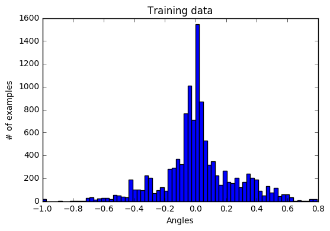
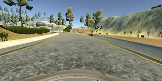
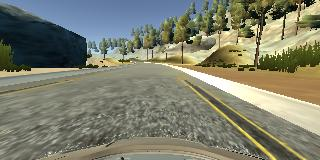
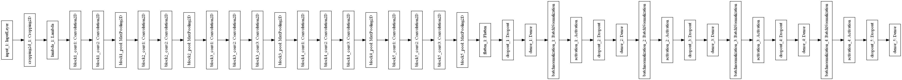

# CarND Behavioral Cloning Project

This project is about training a neural network to drive a car on a simulator using data recorded from a humman driver.

This notebook will be used to create the model to be used in driving the car on the simulator.

The inputs come in three images right, central and left cameras. I decided to use only the center one, because the get good valid values for the left and right images was a bit dificult.

The first thing to do is to clean, then oganize the dataset, and save it to a csv file. for posterior use.

The file driving_log.csv contains steering angles and the left, right and center images associated to it.

### Dataset preparation

I first get all records regarding the center image and shufle them.

Then I split the data into train 80% and validation 20%

Next I save the train and validation array to csv files

### Load data 

In this step the csv files into memory, they are already pre shufled and split

### Explore data

Here I do histogram on the training target, this is also how I try to check if the recorded data is balanced enough, to produce a balanced solution.

Below you can find respectively a center driving image and a recovery driving image.

  

# Model

For the model I decided to experiment with the VGG16 pre-trained model.

By using a pre-trained VGG16 I could get a working model in just one single epoch.

I removed the top fully connected layer, and placed a 4 layers fully connect NN.

But I also experimented with other models, that also performed well but not as well as the VGG.

Relu layers were used to introduce non linearity.

## Chalenges

### Data Colection

For me the bigest chalenge was collecting the right data to train the model.

I had to redo the dataset a few times either because sometimes I had too much recovery examples or too little recovery examples. But in the begining this was a major set back because I thought that the model was the problem, when in reality the problem was the incredibly imbalanced data that I had.

My Dataset is composed of:
- Two center driving laps on the correct direction.
- Two center driving laps on the wrong direction.
- One lap revering from the right on the correct direction
- One lap revering from the right on the wrong direction
- One lap revering from the left on the correct direction
- One lap revering from the left on the wrong direction
- Two other trys on the curves

### Memory limit

I also faced a few issues with memory.

First it's not possible to load the entire dataset into memmory, so a fit generator was used to create the train and validation set, I also flipped the image horizontaly doubling the dataset size, also in the hope of introducing some generalization with it.

Second I had to use smaler batch sizes, because tha GPU that I was using couldn't handle much data.

## Croping

The original image has a shape of (160, 320, 3) than I've croped 60 pixels from the top and 20 pixels from the bottom, to eliminate noise from the top and car.

I've also used the Lambda layer after to normalize the image

## Disadvantages

The resulting model was unnecessarily heavy, because of the VGG model. 

# Training

I chose to use a RMSprop optimizer, because some research poited that it would be quicker to converge.

Also I am using a ModelCheckpoint to save the best evaluated model.

Tests were done straight into the simulator.

The final model can be found on this [link]:https://s3-eu-west-1.amazonaws.com/carnd-project-3/model.h5

